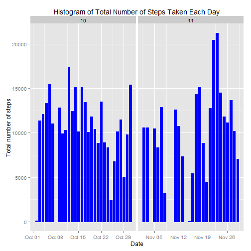
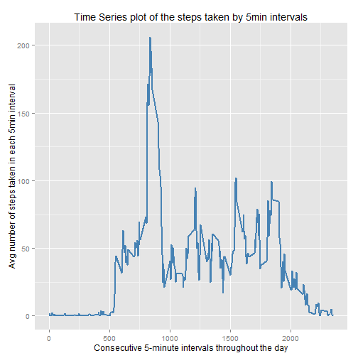
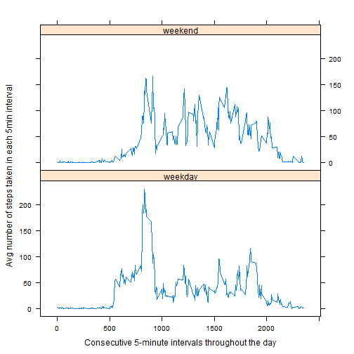

Abstract: Data analysis on data about personal movement using activity monitoring devices.


#### [Set general options]

```r
echo = TRUE  # Always make code visible
options(scipen = 1)  # Turn off scientific notations for numbers
```


### (A) Loading and preprocessing the data

```r
# unzip the compressed data into the current directory
unzip("activity.zip")

# load data into dataframe and set corresponding classes to columns
origData <- read.csv("activity.csv", 
                  colClasses = c("integer", "Date", "factor"))

# add a month column by formatting the date column, for plotting
origData$month <- as.numeric(format(origData$date, "%m"))

# remove missing values and reset rownames
cleanData <- na.omit(origData)
rownames(cleanData) <- 1:nrow(cleanData)

# quick analysis
head(cleanData)
```

```
##   steps       date interval month
## 1     0 2012-10-02        0    10
## 2     0 2012-10-02        5    10
## 3     0 2012-10-02       10    10
## 4     0 2012-10-02       15    10
## 5     0 2012-10-02       20    10
## 6     0 2012-10-02       25    10
```

```r
dim(cleanData)
```

```
## [1] 15264     4
```

### (B) What is mean total number of steps taken per day?

* 1. Calculate the total number of steps taken per day


```r
# load plyr library
library(plyr)
# calculate the total number of steps taken each day
orig.dailysteps <- ddply(cleanData, .(date), summarize,  daytotal=sum(steps))
```

* 2. Make a histogram of the total number of steps taken each day


```r
# load ggplot library
library(ggplot2)

## plot the graph - histogram of the total number of steps taken each day 
ggplot(cleanData, aes(date, steps)) + 
  geom_histogram(stat = "identity", colour = "blue", fill = "blue", width = 0.7) + 
  facet_grid(. ~ month, scales = "free") + 
  labs(title = "Histogram of Total Number of Steps Taken Each Day", x = "Date", y = "Total number of steps")
```

 

* 3. Calculate and report the mean and median of the total number of steps taken per day


```r
# caculate the mean and median steps taken per day
orig.metrics <- ddply(orig.dailysteps, .(), summarize,  mean=mean(daytotal), median=median(daytotal))
orig.metrics$.id <- NULL; row.names(orig.metrics) <- c('Statistics')
# print statistics
orig.metrics
```

```
##                mean median
## Statistics 10766.19  10765
```

The mean number of steps taken per day is 10766.19 steps and the median number of steps taken per day is 10765 steps.


### (C) What is the average daily activity pattern?
* 1. Make a time series plot (i.e. type = "l") of the 5-minute interval (x-axis) and the average number of steps taken, averaged across all days (y-axis


```r
# Aggregates mean steps by interval.
origsteps.byinterval <- aggregate(steps ~ interval, data = cleanData,
                                 FUN = function(x) c(mean = mean(x)))
origsteps.byinterval$interval <- as.numeric(levels(origsteps.byinterval$interval))[origsteps.byinterval$interval]
origsteps.byinterval <- origsteps.byinterval[with(origsteps.byinterval, order(interval)), ]
rownames(origsteps.byinterval) <- 1:nrow(origsteps.byinterval)

## Shows the results in graphical format
#
# [An alternate way for plotting the graph]
# plot(steps ~ interval, data = origsteps.byinterval, type = "l",
#     main = "Time Series plot of the steps taken by 5min intervals",
#     xlab = "Consecutive 5-minute intervals throughout the day",
#     ylab = "Avg number of steps taken in each 5min interval",
#     col = "black")

ggplot(origsteps.byinterval, aes(x=interval, y=steps)) + 
  geom_line(color = "steelblue", size = 0.8) + 
  labs(title = "Time Series plot of the steps taken by 5min intervals", 
       x = "Consecutive 5-minute intervals throughout the day", 
       y = "Avg number of steps taken in each 5min interval")
```

 

* 2. Which 5-minute interval, on average across all the days in the dataset, contains the maximum number of steps?


```r
# Finds the interval with the maximum number of average steps.
active.interval <- origsteps.byinterval$interval[which(origsteps.byinterval$steps == max(origsteps.byinterval$steps))]
active.interval
```

```
## [1] 835
```

On average, the maximum number of steps taken occurs during the 5-minute interval starting at the 835th minute of the day.


### (D) Imputing missing values

* 1. Calculate and report the total number of missing values in the dataset (i.e. the total number of rows with NAs)


```r
sum(is.na(origData))
```

```
## [1] 2304
```

* 2. Devise a strategy for filling in all of the missing values in the dataset. 
The strategy employed here is to use the mean for that 5-minute interval to fill each NA value in the steps column.

* 3. Create a new dataset that is equal to the original dataset but with the missing data filled in.


```r
imputeData <- origData 

for (row in which(is.na(imputeData$steps))) {
    imputeData$steps[row] <- as.numeric(origsteps.byinterval[origsteps.byinterval$interval == imputeData$interval[row],]["steps"])
}


head(imputeData)
```

```
##       steps       date interval month
## 1 1.7169811 2012-10-01        0    10
## 2 0.3396226 2012-10-01        5    10
## 3 0.1320755 2012-10-01       10    10
## 4 0.1509434 2012-10-01       15    10
## 5 0.0754717 2012-10-01       20    10
## 6 2.0943396 2012-10-01       25    10
```

* 4(a). Make a histogram of the total number of steps taken each day and Calculate and report the mean and median total number of steps taken per day using the new dataset


```r
# Aggregates mean steps by interval on impute data.
imputesteps.byinterval <- aggregate(steps ~ interval, data = imputeData,
                                 FUN = function(x) c(mean = mean(x)))
imputesteps.byinterval$interval <- as.numeric(levels(imputesteps.byinterval$interval))[imputesteps.byinterval$interval]
imputesteps.byinterval <- imputesteps.byinterval[with(imputesteps.byinterval, order(interval)), ]
rownames(imputesteps.byinterval) <- 1:nrow(imputesteps.byinterval)

## Shows the results in graphical format
# 
# [An alternate way for plotting the graph]
# plot(steps ~ interval, data = imputesteps.byinterval, type = "l",
#     main = "Time Series plot of the steps taken by 5min intervals",
#     xlab = "Consecutive 5-minute intervals throughout the day",
#     ylab = "Avg number of steps taken in each 5min interval",
#     col = "black")

ggplot(imputesteps.byinterval, aes(x=interval, y=steps)) + 
  geom_line(color = "steelblue", size = 0.8) + 
  labs(title = "Time Series plot of the steps taken by 5min intervals", 
       x = "Consecutive 5-minute intervals throughout the day", 
       y = "Avg number of steps taken in each 5min interval")
```

 

```r
# calculate the total number of steps taken each day
impute.dailysteps <- ddply(imputeData, .(date), summarize,  daytotal=sum(steps))
# caculate the mean and median steps taken per day
impute.metrics <- ddply(impute.dailysteps, .(), summarize,  mean=mean(daytotal), median=median(daytotal))
impute.metrics$.id <- NULL; row.names(impute.metrics) <- c('Statistics')
# print statistics
impute.metrics
```

```
##                mean   median
## Statistics 10766.19 10766.19
```


* 4(b) Do these values differ from the estimates from the first part of the assignment? What is the impact of imputing missing data on the estimates of the total daily number of steps? 

The mean number of steps taken per day with the impute dataset is 10766.19 steps and the median number of steps taken per day is 10766.19 steps. So after replacing missing values (NA) with average steps for the corresponding interval, we found that the mean number of steps taken per day remained the same while the median shifted to match the mean. This ultimately creates less variance in the resulting distribution (compare histograms).

### (E) Are there differences in activity patterns between weekdays and weekends?

* 1. Create a new factor variable in the dataset with two levels - "weekday" and "weekend" indicating whether a given date is a weekday or weekend day.


```r
# create a new column of type factor representing the day of week with 2 levels - 'weekday' & 'weekend' 
imputeData$weekdays <- factor(format(imputeData$date, "%A"))
levels(imputeData$weekdays) <- list(weekday = c("Monday", "Tuesday",
                                             "Wednesday", 
                                             "Thursday", "Friday"),
                                 weekend = c("Saturday", "Sunday"))

# Some basic analysis on the dataset
levels(imputeData$weekdays)
```

```
## [1] "weekday" "weekend"
```

```r
table(imputeData$weekdays)
```

```
## 
## weekday weekend 
##   12960    4608
```

* 2. Make a panel plot containing a time series plot (i.e. type = "l") of the 5-minute interval (x-axis) and the average number of steps taken, averaged across all weekday days or weekend days (y-axis).


```r
daysteps.byinterval <- aggregate(imputeData$steps, 
                      list(interval = as.numeric(as.character(imputeData$interval)), 
                           weekdays = imputeData$weekdays),
                      FUN = "mean")
names(daysteps.byinterval)[3] <- "meansteps"

library(lattice)
xyplot(daysteps.byinterval$meansteps ~ daysteps.byinterval$interval | daysteps.byinterval$weekdays, 
       layout = c(1, 2), type = "l", 
       xlab = "Consecutive 5-minute intervals throughout the day", 
       ylab = "Avg number of steps taken in each 5min interval")
```

 


From the graphs its quite apparent that activities are much more uniformly distributed throughout the day on weekends, except the time interval [810 - 920], compared to weekdays. This shows personal activities tends to be more active during weekends compared to weekdays and the possible negative affect of work/workstyle requirements in their health.
